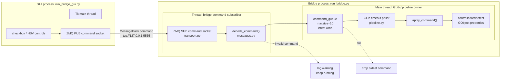

# Bridge Project

This package keeps the ZMQ bridge separated from the GStreamer pipeline.

- `transport.py` owns ZMQ sockets and MessagePack command decoding.
- `pipeline.py` owns GStreamer setup, metadata reading, and detector property
  changes.
- `messages.py` owns command and telemetry message shapes.
- `queues.py` owns bounded "latest value wins" queue insertion.
- `run_bridge_gui.py` is a ZMQ-only GUI client and does not import GStreamer.

## Run

Install dependencies:

```sh
python3 -m venv --system-site-packages .venv
.venv/bin/python -m pip install -r apps/bridge_project/requirements.txt
```

Build plugins:

```sh
cmake --build build
```

Start the bridge:

```sh
.venv/bin/python apps/run_bridge.py
```

Start the GUI in a second terminal:

```sh
.venv/bin/python apps/run_bridge_gui.py
```

Headless bridge test:

```sh
.venv/bin/python apps/run_bridge.py --no-display --num-buffers 5
```

## Command Flow From GUI To Pipeline



The transport layer never calls GStreamer code directly. It only decodes ZMQ
payloads and offers command objects to `command_queue`. The pipeline drains that
queue from the GLib main loop and applies detector properties there.

## Metadata And Telemetry Flow To GUI

```mermaid
flowchart LR
    subgraph BridgeProcess["Bridge process: run_bridge.py"]
        subgraph GstStreamingThread["GStreamer streaming thread"]
            Source["colorboxsrc"]
            Detector["controlledreddetect"]
            Tee["tee"]
            Appsink["appsink\nmax-buffers=1 drop=true"]
            ReadMeta["read_detection_message()\npipeline.py"]
        end

        subgraph VideoSinkBranch["GStreamer video sink branch"]
            VideoBranch["queue -> videoconvert -> autovideosink"]
        end

        subgraph PublisherThread["Thread: bridge-telemetry-publisher"]
            DetectionQueue["detection_queue\nmaxsize=1\nlatest wins"]
            Publisher["publish_loop()\nrun_bridge.py"]
            TelemetryPub["ZMQ PUB telemetry socket"]
        end
    end

    subgraph GuiProcess["GUI process: run_bridge_gui.py"]
        subgraph GuiThread["Tk main thread"]
            TelemetrySocket["ZMQ SUB telemetry socket"]
            Validate["decode_detection_message()\nmessages.py"]
            Display["GUI result label"]
        end
    end

    Source --> Detector
    Detector -->|GstRedDetectionMeta| Tee
    Tee --> VideoBranch
    Tee --> Appsink
    Appsink --> ReadMeta
    ReadMeta --> DetectionQueue
    DetectionQueue --> Publisher
    Publisher --> TelemetryPub
    TelemetryPub -->|MessagePack detection\ntcp://127.0.0.1:5556| TelemetrySocket
    TelemetrySocket --> Validate
    Validate --> Display

    DetectionQueue -. full .-> DropDetection["drop stale detection"]
    Validate -. invalid telemetry .-> Status["GUI status label\nkeep polling"]
```



The appsink callback copies only the small metadata payload into a bounded queue
and returns quickly. Slow GUI clients should not block the GStreamer streaming
path.

## Message Shapes

Enable or disable detection:

```text
{"type": "set_detection_enabled", "enabled": true}
```

Update HSV thresholds:

```text
{
  "type": "set_hsv_thresholds",
  "low_h": 0,
  "low_s": 100,
  "low_v": 100,
  "high_h": 10,
  "high_s": 255,
  "high_v": 255
}
```

Detection telemetry:

```text
{
  "type": "detection",
  "frame": 42,
  "timestamp_ns": 1400000000,
  "found": true,
  "x": 120,
  "y": 80,
  "width": 40,
  "height": 40
}
```

## Separation Rules

- Do not import `gi`, `Gst`, or `GLib` from `transport.py` or GUI code.
- Do not import `zmq` from `pipeline.py`.
- Apply detector properties only from the pipeline side.
- Keep appsink callbacks short and non-blocking.
- Use bounded queues for cross-thread handoff.
