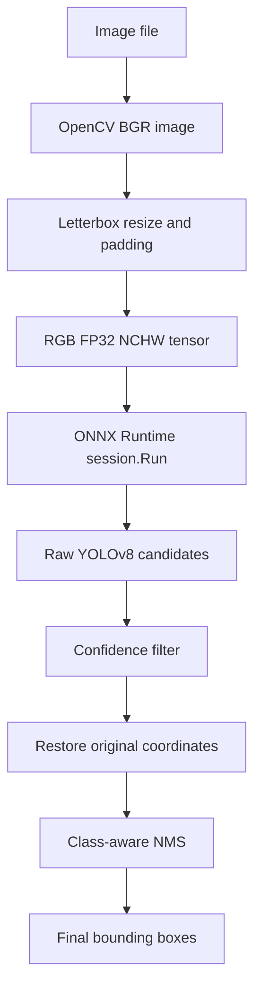
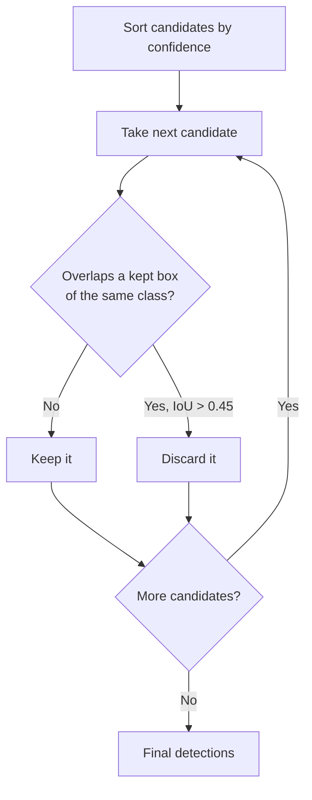
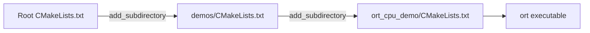

# YOLOv8 with ONNX Runtime C++ on CPU

This demo runs one image through a YOLOv8 nano model and prints the detected
bounding boxes. ONNX Runtime executes the neural network. The C++ code performs
the image preprocessing and YOLO postprocessing itself.

## 1. Install the Dependencies

From the repository root, install the compiler, CMake, and the OpenCV parts
used to load and resize images:

```bash
sudo apt update
sudo apt install build-essential cmake libopencv-dev python3-venv
```

OpenCV DNN is not used. Inference is performed only by ONNX Runtime.

### ONNX Runtime C++

The repository already contains the ONNX Runtime 1.29.0 Linux x64 CPU package:

```text
third_party/onnxruntime-linux-x64-1.29.0/
├── include/onnxruntime_cxx_api.h
└── lib/libonnxruntime.so
```

To download and extract that package again:

```bash
cd third_party
curl -fLO https://github.com/microsoft/onnxruntime/releases/download/v1.29.0/onnxruntime-linux-x64-1.29.0.tgz
tar -xzf onnxruntime-linux-x64-1.29.0.tgz
rm onnxruntime-linux-x64-1.29.0.tgz
cd ..
```

### YOLOv8 Nano Model

The converted model is already present at `demos/ort_cpu_demo/yolov8n.onnx`.
To reproduce it, install the export tools:

```bash
python3 -m venv .venv
.venv/bin/python -m pip install ultralytics onnx onnxslim
```

Download the original PyTorch model:

```bash
curl -fL https://github.com/ultralytics/assets/releases/download/v8.3.0/yolov8n.pt \
  -o demos/ort_cpu_demo/yolov8n.pt
```

Export a fixed 640 x 640, batch-one model without embedded NMS:

```bash
.venv/bin/yolo export model=demos/ort_cpu_demo/yolov8n.pt format=onnx imgsz=640 batch=1 dynamic=False nms=False
```

`nms=False` is important because this demo expects the raw YOLOv8 output and
implements confidence filtering and NMS in C++.

## 2. Build and Run

The bundled ONNX Runtime directory is the default:

```bash
cmake -S . -B build
cmake --build build --target ort
```

Run inference on an image:

```bash
./build/demos/ort_cpu_demo/ort \
  demos/ort_cpu_demo/yolov8n.onnx \
  /absolute/path/to/image.jpg
```

Example output:

```text
detections: 2
class=0 confidence=0.91 x=52 y=41 width=120 height=280
class=5 confidence=0.83 x=230 y=95 width=310 height=190
```

The coordinates use the original image's pixels. Classes are numeric COCO
class IDs because this minimal demo does not load label names.

## 3. Basic Idea

YOLO cannot consume the bytes returned directly by `cv::imread()`. The image
must first be resized, padded, reordered, and normalized. The model produces
candidate predictions rather than final boxes, so its output must also be
decoded and filtered.



The data shapes for the bundled model are:

```text
image                 variable height x width x 3, BGR uint8
model input           [1, 3, 640, 640], RGB float32
model output          [1, 84, 8400], float32
final detection       class + confidence + x + y + width + height
```

For COCO YOLOv8, `84` output channels means four box values plus 80 class
scores. `8400` is the number of candidate predictions.

## 4. Source Code Map

The implementation is intentionally kept in one file:

```text
ort.cpp
├── Detection                   final class, score, and source-image box
├── Letterbox                   input tensor plus resize/padding information
├── preprocess()                image to model tensor
├── intersection_over_union()   overlap measurement used by NMS
├── to_source_box()             model coordinates to original coordinates
├── postprocess()               decode, filter, and suppress candidates
└── main()                      load, validate, infer, and print
```

## 5. `main()` from Top to Bottom

### Step 1: Read the Arguments

The executable expects a model and an image:

```cpp
const std::string model_path = argv[1];
const std::string image_path = argv[2];
```

### Step 2: Load the Image

```cpp
const cv::Mat image = cv::imread(image_path);
```

`imread()` returns an interleaved unsigned 8-bit BGR image shaped conceptually
as `[height, width, 3]`.

### Step 3: Create the ONNX Runtime Session

```cpp
Ort::Env environment(ORT_LOGGING_LEVEL_WARNING, "yolov8-demo");
Ort::SessionOptions options;
options.SetGraphOptimizationLevel(GraphOptimizationLevel::ORT_ENABLE_ALL);
Ort::Session session(environment, model_path.c_str(), options);
```

- `Ort::Env` owns the process-level ONNX Runtime environment.
- `Ort::SessionOptions` controls how the model runs.
- `Ort::Session` loads and prepares the ONNX graph.
- No execution provider is added, so ONNX Runtime uses its CPU provider.

The objects remain alive until `main()` exits. Their destructors release the
native ONNX Runtime resources automatically.

### Steps 4-5: Inspect the Model Contract

The demo accepts exactly one input and one output. It asks the loaded model for
the input shape instead of assuming 640 x 640:

```cpp
const std::vector<int64_t> input_shape = session.GetInputTypeInfo(0)
    .GetTensorTypeAndShapeInfo()
    .GetShape();
```

The required layout is `[batch, channels, height, width]`, with batch `1`,
three color channels, and fixed positive dimensions.

### Step 6: Preprocess the Image

```cpp
Letterbox letterbox = preprocess(image, input_width, input_height);
```

`preprocess()` returns both the tensor data and the scale/padding values needed
later to restore bounding boxes.

### Step 7: Wrap the Input Tensor

```cpp
Ort::Value input = Ort::Value::CreateTensor<float>(
    memory,
    letterbox.input.data(),
    letterbox.input.size(),
    input_shape.data(),
    input_shape.size()
);
```

This does not copy the float data. `Ort::Value` points at
`letterbox.input`, so the `Letterbox` object must stay alive through
`session.Run()`.

### Steps 8-9: Select Nodes and Run Inference

Input and output node names belong to the ONNX model, so the program queries
them at runtime:

```cpp
auto input_name = session.GetInputNameAllocated(0, allocator);
auto output_name = session.GetOutputNameAllocated(0, allocator);
```

The synchronous inference call is:

```cpp
std::vector<Ort::Value> outputs = session.Run(
    run_options,
    input_names,
    &input,
    input_count,
    output_names,
    output_count
);
```

```text
run_options   options for this single call
input_names   model node receiving the input
&input        tensor passed to that node
input_count   number of input names and tensors
output_names  model nodes whose values are requested
output_count  number of requested outputs
```

`Run()` blocks until CPU inference finishes. The returned vector owns the
output tensors allocated by ONNX Runtime.

### Steps 10-12: Validate, Postprocess, and Print

The program verifies that the output is three-dimensional, then passes its
float memory to `postprocess()`:

```cpp
const std::vector<Detection> detections = postprocess(
    outputs[0].GetTensorData<float>(),
    output_shape[1],
    output_shape[2],
    letterbox,
    image.size(),
    confidence_threshold,
    iou_threshold
);
```

The final loop prints each retained detection in source-image coordinates.

## 6. Preprocessing Drilldown

### Letterbox Resize

Stretching a rectangular image directly to a square changes object shapes.
Letterboxing instead uses one scale for both axes and fills the unused area.

```text
original image                 640 x 640 model input

+------------------+          +--------------------------+
|                  |          |       padding = 114      |
|   original       | resize   |+------------------------+|
|   aspect ratio   | -------> || resized image          ||
|                  |          |+------------------------+|
+------------------+          |       padding = 114      |
                              +--------------------------+
```

The scale and centered padding are:

```text
scale = min(model_width / image_width, model_height / image_height)
pad_x = (model_width  - resized_width)  / 2
pad_y = (model_height - resized_height) / 2
```

The padding value `114` matches the common Ultralytics preprocessing value.

### BGR/HWC to RGB/NCHW

OpenCV and the model use different memory conventions:

```text
OpenCV pixel memory                 YOLO input memory

B G R | B G R | B G R ...          all R values
                                    all G values
                                    all B values

HWC uint8 [0, 255]       --->       NCHW float32 [0, 1]
```

For pixel index `i`, the code writes:

```cpp
input[i] = bgr[2] / 255.0F;                  // red plane
input[plane_size + i] = bgr[1] / 255.0F;     // green plane
input[2 * plane_size + i] = bgr[0] / 255.0F; // blue plane
```

## 7. YOLOv8 Output Drilldown

The raw output is stored channel-first:

```text
                    candidate 0  candidate 1  ... candidate 8399
center_x                 x0           x1                 x8399
center_y                 y0           y1                 y8399
width                    w0           w1                 w8399
height                   h0           h1                 h8399
class 0 score            s0           s1                 ...
class 1 score            s0           s1                 ...
...                      ...          ...                ...
class 79 score           s0           s1                 ...
```

For each candidate, `postprocess()` finds the largest class score. Candidates
below `0.25` are discarded. Raw YOLOv8 detection output has no separate
objectness row, so the selected class score is used as confidence.

### Restore Original Coordinates

YOLO emits a center-based box in letterboxed model coordinates:

```text
left   = center_x - width / 2
top    = center_y - height / 2
right  = center_x + width / 2
bottom = center_y + height / 2
```

Undo the letterbox transform for every coordinate:

```text
source_x = (model_x - pad_x) / scale
source_y = (model_y - pad_y) / scale
```

The result is clipped to the source image. Empty boxes are discarded.

### Class-Aware Non-Maximum Suppression

Many candidates describe the same object. NMS keeps the strongest candidate
and rejects weaker boxes of the same class when their intersection-over-union
is above `0.45`.



IoU measures overlap relative to the combined area:

```text
IoU = intersection area / union area
```

Different classes do not suppress one another.

## 8. Project and CMake Flow

```text
gst_cpp_plugin_tutorial/
├── CMakeLists.txt
├── demos/
│   ├── CMakeLists.txt
│   └── ort_cpu_demo/
│       ├── CMakeLists.txt
│       ├── README.md
│       ├── ort.cpp
│       ├── yolov8n.pt
│       └── yolov8n.onnx
└── third_party/
    └── onnxruntime-linux-x64-1.29.0/
        ├── include/
        └── lib/
```

CMake enters each directory in order:



The root CMake file locates ONNX Runtime once and creates the imported
`ONNXRuntime::ONNXRuntime` target. The demo CMake file finds OpenCV and defines
the executable:

```cmake
add_executable(ort ort.cpp)
target_link_libraries(ort PRIVATE ONNXRuntime::ONNXRuntime ${OpenCV_LIBS})
```

The build RPATH points at the located ONNX Runtime library directory, allowing
the build-tree executable to find `libonnxruntime.so` when it starts.

To use another extracted runtime instead of the bundled one:

```bash
cmake -S . -B build -DONNXRUNTIME_ROOT=/absolute/path/to/onnxruntime
cmake --build build --target ort
```
