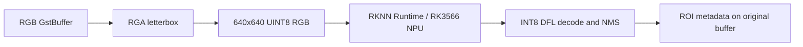

# RKNN YOLOv8 GStreamer Plugin Design

## Goal

`rknnyolodetect` is the Radxa Zero 3W counterpart to `yolodetect`. It runs a
specific RK3566 YOLOv8 model synchronously on the NPU and attaches the same
standard ROI metadata without changing the image.



## Interface

The always-present sink and source pads accept `video/x-raw,format=RGB` in
system memory. The READY-only properties match the ONNX element:

| Property | Default | Meaning |
|---|---:|---|
| `model-path` | none | Required RK3566 `.rknn` model |
| `confidence-threshold` | `0.25` | Minimum class confidence |
| `iou-threshold` | `0.45` | Class-aware NMS threshold |

Each detection adds `GstVideoRegionOfInterestMeta` with ROI type
`yolo-detection`. Its `yolo` parameter contains integer `class-id` and double
`confidence` fields. Pixels, timestamps, duration, and ordering are preserved.

## Model and Frame Processing

Startup loads the model with `rknn_init`, queries the runtime/driver version,
and accepts only the inspected model contract:

```text
input:  one 640 x 640 RGB tensor
output: nine affine INT8 NCHW tensors
        box [1,64,G,G], classes [1,80,G,G], score sum [1,1,G,G]
        for G = 80, 40, 20
```

Tightly packed, 16-pixel-aligned frames are passed directly to RGA. Other
strides are copied row-by-row into reusable aligned memory. RGA fills the model
canvas with value 114 and resizes the source into a centered letterbox region.
The plugin submits that buffer as UINT8 NHWC; RKNN performs the model's internal
conversion and normalization.

Postprocessing dequantizes the three detection heads, computes the 16-bin DFL
box distributions, filters scores, reverses the letterbox transform, clips to
the source frame, and performs class-aware NMS. The initial NMS is deliberately
O(n²); replace it only if measurements show it matters.

All RGA, RKNN, mapping, validation, and metadata failures post a GStreamer
element error. Debug level 6 reports detection count and RGA, RKNN,
postprocessing, and metadata time per frame.

## Build and Deployment

The isolated `radxa` CMake project uses the host ARM64 compiler and
`/home/user/sysroots/radxa`. It builds only `rknnyolodetect` and `metaprint`, so
the native ONNX build remains independent.

The target is host `radxa`, Debian 12 arm64, GStreamer 1.22.9, RKNN Runtime
2.3.0, and RGA 2.2. The RKNN model stays external. See the RKNN usage document
for sysroot preparation, build, deployment, and verification commands.

## Deferred Work

Version 1 excludes drawing, labels, OpenCV fallback, other RKNN tensor layouts,
DMA-BUF zero-copy, async execution, batching, and ONNX/RKNN code sharing.
