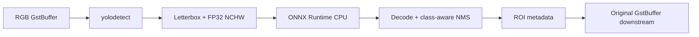
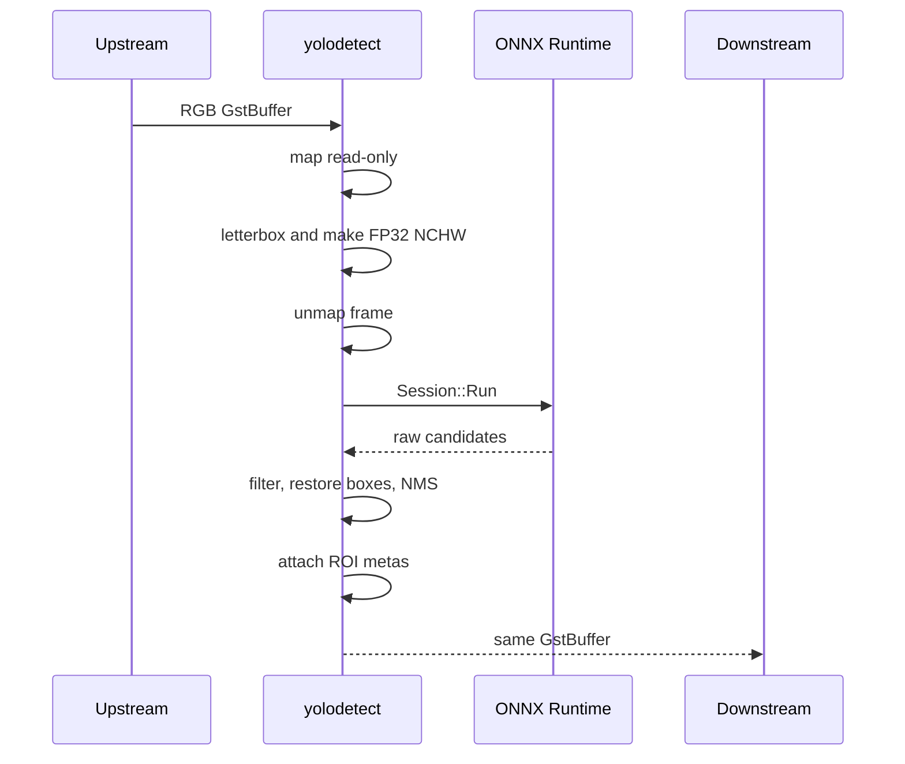

# Synchronous YOLOv8 GStreamer Plugin Design

## Goal

Add a minimal `yolodetect` element that receives prepared RGB video frames,
runs a raw YOLOv8 detection model with ONNX Runtime CPU, attaches bounding-box
metadata, and pushes the same image buffer downstream. Version 1 deliberately
runs synchronously so its behavior is easy to understand and verify.



## Dependencies

- GStreamer core, base, and video development packages
- OpenCV core and imgproc for frame views, resize, and padding
- ONNX Runtime C++ CPU package
- A fixed-shape Ultralytics YOLOv8 detection export

The repository keeps ONNX Runtime at
`third_party/onnxruntime-linux-x64-1.29.0`. The root CMake file exposes it as
`ONNXRuntime::ONNXRuntime`; both the plugin and standalone demo use that target.
Another extraction can be selected with
`-DONNXRUNTIME_ROOT=/absolute/path/to/onnxruntime`.

The model must be exported as fixed batch-one FP32 with embedded NMS disabled:

```bash
yolo export model=yolov8n.pt format=onnx imgsz=640 batch=1 dynamic=False nms=False
```

## Public Element Contract

Element name: `yolodetect`

Both always-present pads accept only:

```text
video/x-raw,format=RGB
```

Width, height, and framerate remain unconstrained. The element letterboxes each
negotiated frame to the model size internally. It does not alter pixels,
timestamps, duration, or buffer order.

Properties are writable only through READY state:

| Property | Type | Default | Meaning |
|---|---:|---:|---|
| `model-path` | string | none | Required path to the ONNX model |
| `confidence-threshold` | double | `0.25` | Minimum best-class score |
| `iou-threshold` | double | `0.45` | Same-class NMS overlap threshold |

The model session is created in `start()` and destroyed in `stop()`. Startup
rejects absent paths or models outside this exact contract:

```text
input:  one FP32 tensor  [1, 3, model_height, model_width]
output: one FP32 tensor  [1, 4 + class_count, candidate_count]
```

All dimensions must be static and positive. This excludes dynamic exports,
models with embedded NMS, segmentation, pose, and other YOLO layouts.

## Per-Buffer Flow

`transform_ip()` performs the entire operation before returning:



### Preprocessing

For source size `(W, H)` and model size `(Mw, Mh)`:

```text
scale = min(Mw / W, Mh / H)
resized = round((W, H) * scale)
padding = floor((model size - resized size) / 2)
```

The resized RGB image is centered on a `(114,114,114)` canvas. Its interleaved
8-bit channels are converted to planar RGB floats in `[0,1]`, producing NCHW
`[1,3,Mh,Mw]`. `GstVideoFrame` supplies the actual row stride, so padded source
buffers are handled correctly.

### Inference

One input tensor is created over the preprocessing vector and passed to
`Ort::Session::Run`. No OpenCV DNN API is used. The default ONNX Runtime CPU
execution provider performs inference on the streaming thread.

### Postprocessing

For each output candidate, channels 0-3 are center-x, center-y, width, and
height. Remaining channels are class scores. Processing is:

1. Select the highest scoring class.
2. Drop candidates below `confidence-threshold`.
3. Reverse padding and scale to return to source coordinates.
4. Clip every edge to the source frame and discard zero-area boxes.
5. Sort by score and apply class-aware NMS using `iou-threshold`.

The initial NMS is an intentionally small O(n²) implementation. It should be
replaced only if profiling shows candidate suppression is material.

## Metadata Contract

Each retained detection adds one standard
`GstVideoRegionOfInterestMeta` to the writable buffer:

```text
roi_type = "yolo-detection"
x, y, w, h = source-frame integer pixels
params["yolo"] = {
    "class-id": int,
    "confidence": double
}
```

Class IDs remain numeric; version 1 does not load labels. A frame with no
detections receives no ROI metadata. `metaprint` reads all matching metas and
prints the ROI type, class, confidence, rectangle, and buffer PTS.

## Errors and Observability

Model loading, tensor validation, frame mapping, inference, decoding, and
metadata attachment failures post a GStreamer element error and stop the
pipeline. At the `LOG` debug level, each processed frame reports detection
count plus preprocessing, inference, and postprocessing time:

```bash
GST_DEBUG=yolodetect:6 GST_PLUGIN_PATH="$PWD/build" gst-launch-1.0 ...
```

## Build and Verification

```bash
cmake -S . -B build
cmake --build build
GST_PLUGIN_PATH="$PWD/build" gst-inspect-1.0 yolodetect
```

Run the bundled image and model:

```bash
GST_PLUGIN_PATH="$PWD/build" gst-launch-1.0 -q \
  filesrc location=assets/bus.jpg ! jpegdec ! videoconvert ! \
  video/x-raw,format=RGB ! \
  yolodetect model-path="$PWD/demos/ort_cpu_demo/yolov8n.onnx" ! \
  metaprint ! fakesink
```

Verification covers successful inspection, multiple valid ROIs on `bus.jpg`,
clean EOS with zero detections, startup failure without a model, RGB-only caps
negotiation, and debug timing output.

## Deferred Work

Version 1 excludes BGR/YUV input, drawing, label lookup, live property changes,
CUDA, batching, tracking, segmentation, pose, and generalized YOLO layouts.

Asynchronous operation is a later milestone. First measure the synchronous
timings. A non-blocking pipeline can initially isolate this unchanged element
behind `tee ! queue leaky=downstream max-size-buffers=1`; a worker-based element
is justified only if that composition cannot meet the measured requirement.
