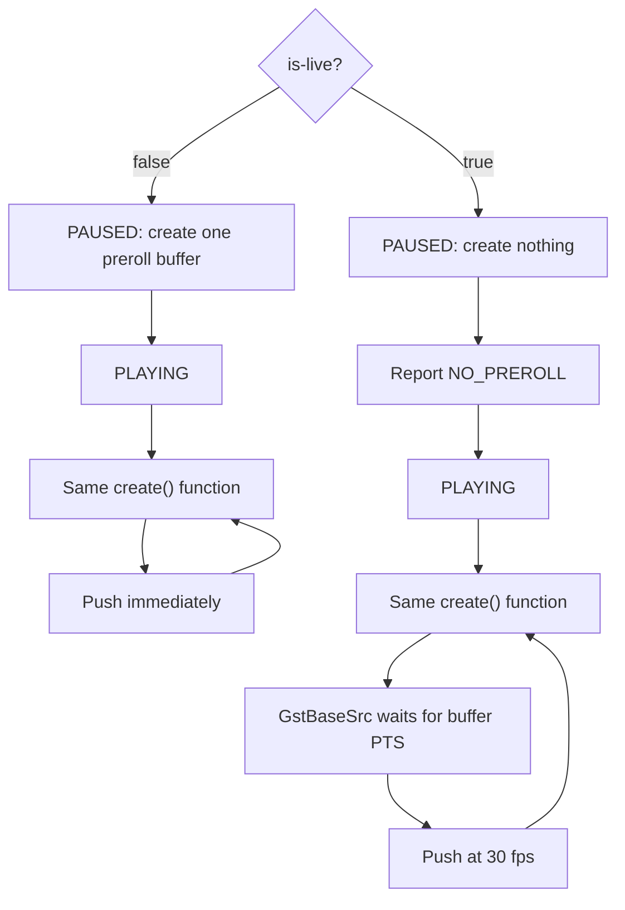

# Minimal Live Source Plugin

This example isolates one question: what changes when a `GstBaseSrc` is live?

The `is_livesrc` element produces no media payload. It pushes empty buffers
whose timestamps advance at 30 frames per second. This keeps the example
focused on state changes, timestamps, and clock scheduling.

## Inspect

```sh
GST_PLUGIN_PATH="$PWD/build" gst-inspect-1.0 is_livesrc
```

The `is-live` property defaults to `true`. It can only be changed before the
element moves beyond `READY`.

## Live Mode

```sh
GST_PLUGIN_PATH="$PWD/build" gst-launch-1.0 -v \
    is_livesrc num-buffers=60 is-live=true ! \
    identity silent=false ! \
    fakesink sync=false
```

The pipeline prints:

```text
Pipeline is live and does not need PREROLL ...
```

The 60 buffers take about two seconds even though `fakesink` has `sync=false`.
The source is paced before buffers reach the sink.

## Non-Live Mode

```sh
GST_PLUGIN_PATH="$PWD/build" gst-launch-1.0 -v \
    is_livesrc num-buffers=60 is-live=false ! \
    identity silent=false ! \
    fakesink sync=false
```

This pipeline prerolls normally and then produces all 60 buffers as quickly as
the computer can process them.

## `NO_PREROLL`

A non-live pipeline produces a first buffer while changing from `READY` to
`PAUSED`. The sink holds that buffer so it is ready when playback begins. This
preparation is called preroll.

A live source does not produce data in `PAUSED`. Its state change reports
`GST_STATE_CHANGE_NO_PREROLL`, telling the pipeline not to wait for a first
buffer. Production starts when the pipeline enters `PLAYING`.

`NO_PREROLL` is a state-change result, not an error.

## Is Buffer Creation Different?

No. Live and non-live modes use the same `create()` function and produce the
same empty buffer with the same PTS, duration, and offset:

```cpp
static GstFlowReturn gst_is_live_src_create(
    GstPushSrc* src,
    GstBuffer** buffer)
{
    GstIsLiveSrc* self =
        reinterpret_cast<GstIsLiveSrc*>(src);

    GstBuffer* out_buffer = gst_buffer_new();
    const GstClockTime pts = gst_util_uint64_scale(
        self->frame_number,
        GST_SECOND,
        30
    );
    const GstClockTime next_pts = gst_util_uint64_scale(
        self->frame_number + 1,
        GST_SECOND,
        30
    );

    GST_BUFFER_PTS(out_buffer) = pts;
    GST_BUFFER_DURATION(out_buffer) = next_pts - pts;

    self->frame_number++;
    *buffer = out_buffer;
    return GST_FLOW_OK;
}
```

The difference is when GStreamer calls `create()` and what happens after it
returns:

| Behavior | `is-live=false` | `is-live=true` |
| --- | --- | --- |
| In `PAUSED` | Creates a preroll buffer | Creates no buffer and reports `NO_PREROLL` |
| In `PLAYING` | Calls the same `create()` | Calls the same `create()` |
| After `create()` | Pushes without a source clock wait | Waits for the buffer PTS, then pushes |
| Result | Runs as fast as downstream accepts buffers | Delivers buffers at 30 fps |

The same `create()` implementation participates in two different scheduling
flows:



`create()` determines what the buffer contains. Live mode and `get_times()`
determine when buffers are created and delivered.

## Why `is-live` Is Not Enough

Setting live mode controls whether the source produces data in `PAUSED`, but it
does not describe when each generated buffer should be pushed.

`is_livesrc` implements `GstBaseSrc::get_times()`. In live mode, the callback
returns each buffer's PTS and end time. `GstBaseSrc` waits on the pipeline clock
until that running time before pushing the buffer downstream.

The two responsibilities are separate:

```text
gst_base_src_set_live()
    -> PLAYING-only production and NO_PREROLL

GstBaseSrc::get_times()
    -> clock-paced buffer delivery
```

In non-live mode, `get_times()` returns `GST_CLOCK_TIME_NONE`, so the source
does not wait on the clock.

## Why Use `identity`?

The source does not print from its `create()` function because `create()` runs
before `GstBaseSrc` performs its clock wait. A message there would describe
buffer creation, not downstream delivery.

The built-in `identity` element prints buffers after they leave the source. Its
output includes PTS, duration, and offset, so no custom metadata or additional
printer plugin is needed.
