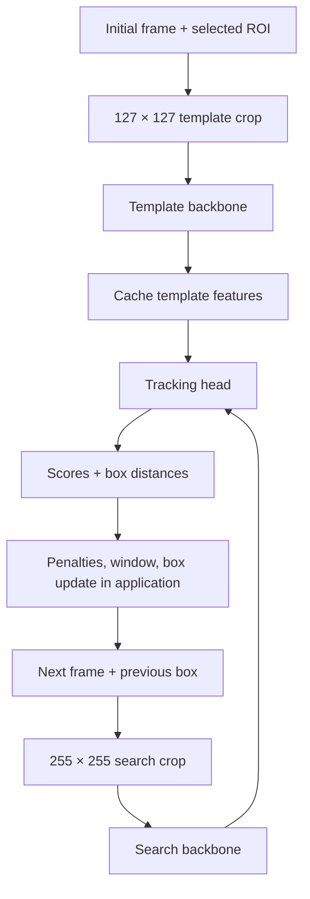

# Convert NanoTrack ONNX Models to RKNN

This guide targets the Radxa Zero 3W (RK3566) and the three ONNX models in
`demos/nanotracker/onnx/`. Start with unquantized FP16 models, verify tracking,
then introduce INT8 quantization one graph at a time.

The commands below describe conversion; they do not replace the ONNX sessions
in the existing [Python tracker](../../demos/nanotracker/onnx/onnx_demo.py).
RKNN conversion and on-board tracking have not been validated for these graphs
as part of writing this document. In particular, successful ONNX inference does
not guarantee the RKNN compiler supports every operation in the head.

## 1. Install the Conversion Tools

Run conversion on your Linux development PC. Use **RKNN-Toolkit2** for model
conversion. RKNN-Toolkit-Lite2 and `librknnrt.so` run compiled models on the
board; neither replaces the conversion toolkit. RK3566 is a supported Toolkit2
target. See the [official repository and installation documentation](https://github.com/airockchip/rknn-toolkit2).

Use a toolkit release compatible with the board's runtime and NPU driver. This
project's Radxa setup records runtime 2.3.0; check the actual board before
selecting a release. Prefer a matching SDK release initially, and record its
version with the exported models. Do not silently upgrade the board's graphics
or NPU stack to match a newly downloaded compiler.

Download the Linux x86-64 wheel and requirements for the selected release from
the official repository. Choose a wheel matching your Python version (`cp310`
means Python 3.10, for example). With that compatible Python installed:

```bash
python3 -m venv .venv-rknn
source .venv-rknn/bin/activate
python -m pip install --upgrade pip
# Replace these paths with the selected release's files.
python -m pip install -r /path/to/requirements_for_your_python.txt
python -m pip install /path/to/rknn_toolkit2_matching_python_linux_x86_64.whl
python -m pip install onnxruntime
python -c 'from rknn.api import RKNN; print("Toolkit import OK")'
```

Run the remaining commands from the repository root in this environment.

## 2. Understand the Three Graphs

NanoTrack follows one selected object. It computes template features once at
initialization, computes search features on subsequent frames, and compares
both in the head. Cropping and final box decoding remain application code.



These names and shapes were inspected from the local ONNX files:

| File | Inputs, NCHW | Outputs |
| --- | --- | --- |
| `nanotrack_backbone_template.onnx` | `input`: `[1,3,127,127]` | `output`: `[1,96,8,8]` |
| `nanotrack_backbone.onnx` | `input`: `[1,3,255,255]` | `output`: `[1,96,16,16]` |
| `nanotrack_head.onnx` | `input1`: `[1,96,8,8]`; `input2`: `[1,96,16,16]` | `output1`: `[1,2,15,15]`; `output2`: `[1,4,15,15]` |

Keep both fixed-size backbone exports. The template graph uses the same
backbone computation at a smaller spatial size. Do not resize its feature
output to imitate the search backbone.

The local `crop_for_model()` function produces contiguous **BGR, NCHW,
float32, 0–255** tensors. It adds context, pads with the video's average color,
and resizes the crop. Preserve this behavior: no RGB swap, division by 255, or
YOLO letterboxing. The head consumes feature values, not pixel values.

## 3. First Milestone: Export FP16

Keep the source ONNX files in FP32. The RKNN build selects FP16 internally with
`float_dtype="float16"` and `do_quantization=False`; no calibration dataset is
needed. FP16 internal computation does not mean the runtime API must receive
FP16 buffers. Query the compiled model's tensor attributes when integrating it.

Save this example as `convert_nanotrack.py` in the repository root:

```python
"""Convert all three fixed-shape NanoTrack graphs for RK3566.

Default: FP16 without calibration. Pass --int8 with three calibration lists
after validating FP16. Inputs are already preprocessed, so config leaves
normalization at its identity defaults for both pixels and feature tensors.
"""
import argparse
from pathlib import Path
from rknn.api import RKNN


def check(status, operation):
    if status != 0:
        raise RuntimeError(f"{operation} failed: {status}")


def convert(source, destination, dataset):
    # 1. Select chip and floating-point precision.
    rknn = RKNN(verbose=True)
    try:
        check(rknn.config(target_platform="rk3566", float_dtype="float16"),
              "config")
        # 2. Import the fixed-shape graph with its existing input order.
        check(rknn.load_onnx(model=str(source)), "load_onnx")
        # 3. Compile; calibration is enabled only when a list is supplied.
        options = {"do_quantization": dataset is not None}
        if dataset is not None:
            options["dataset"] = str(dataset)
        check(rknn.build(**options), "build")
        # 4. Write a distinct artifact, preserving the ONNX source.
        check(rknn.export_rknn(str(destination)), "export_rknn")
    finally:
        rknn.release()


if __name__ == "__main__":
    parser = argparse.ArgumentParser()
    parser.add_argument("--int8", action="store_true")
    args = parser.parse_args()
    source_dir = Path("demos/nanotracker/onnx")
    precision = "int8" if args.int8 else "fp16"
    output_dir = Path("demos/nanotracker/rknn") / precision
    output_dir.mkdir(parents=True, exist_ok=True)
    for name, calibration in [
        ("nanotrack_backbone_template", "template.txt"),
        ("nanotrack_backbone", "search.txt"),
        ("nanotrack_head", "head.txt"),
    ]:
        dataset = Path("calibration") / calibration if args.int8 else None
        if dataset is not None and not dataset.is_file():
            raise FileNotFoundError(dataset)
        convert(source_dir / f"{name}.onnx",
                output_dir / f"{name}.rknn", dataset)
```

```bash
python convert_nanotrack.py
```

The config → import → build → export sequence follows Rockchip's
[conversion example](https://github.com/airockchip/rknn-toolkit2/blob/master/rknn-toolkit2/examples/onnx/yolov5/test.py).
Its YOLO normalization settings do **not** apply to this tracker.

If the head fails to compile, retain the compiler log and identify the failing
node/operator. Keep the head in ONNX Runtime as a temporary baseline while
testing the two RKNN backbones. Changing precision alone does not resolve an
unsupported operator; do not report a complete NPU tracker until the head works.

## 4. Validate FP16 Before Quantization

Save real template/search crops from the existing tracker, together with its
ONNX backbone and head outputs. Use the same tensors as RKNN inputs. First
compare each graph independently, then connect the graphs and replay the same
video with the same initial ROI.

For Toolkit2 simulator testing, after building a graph and before releasing it:

```python
check(rknn.init_runtime(), "init_runtime")  # PC simulator
inputs = [np.load(path) for path in input_paths]  # import numpy as np
outputs = rknn.inference(inputs=inputs, data_format=["nchw"] * len(inputs))
```

Here `input_paths` is one crop file for a backbone, or the ordered template and
search feature files for the head. This is an insertion snippet, not a separate
complete script. Check output shapes, finite values, mean/max absolute error,
and tracking box overlap with ONNX. FP16 need not be bit-identical to FP32.

Then deploy to the board and test using Toolkit-Lite2 or the C RKNN API. The PC
simulator does not establish on-board performance or runtime compatibility.
Start the C integration with ordinary tensor buffers and float outputs
(`want_float=1`). Query input/output dimensions, format, type, scale, and zero
point; explicitly adapt layout between graphs. Do not reinterpret an NHWC
buffer as NCHW simply because the element count matches.

Keep the existing tracker postprocessing: score conversion, scale/aspect
penalties, Hann window, best location selection, coordinate restoration, and
box smoothing. This head does not use YOLO confidence filtering or NMS.

## 5. Second Milestone: Understand INT8 Quantization

FP16 retains floating-point values with reduced precision. INT8 represents
values using a bounded integer range plus a scale and zero point:

```text
q ≈ clamp(round(real / scale) + zero_point)
real ≈ (q - zero_point) * scale
```

Calibration runs representative inputs through the graph to estimate useful
activation ranges. It does not train the tracker, and it does not require class
labels. Cropping representative tracked objects still requires valid ROIs.
INT8 can reduce compute/memory cost, but end-to-end speed and tracking accuracy
must be measured on the board. Some operations can remain floating point.

Introduce quantization in this order:

1. Quantize the search backbone, keeping template backbone and head FP16.
   Search inference runs every frame, so measure this first.
2. Quantize the template backbone and repeat the accuracy check. Its error is
   cached and affects every subsequent frame, while its compute cost is usually
   paid only at initialization.
3. Quantize the head last. Small score changes can alter the selected location
   and cause drift across later frames. Retain an FP16 head if needed.

The converter exports all three INT8 candidates; choose FP16/INT8 artifacts
independently when integrating the tracker.

## 6. Build Three Calibration Lists

Use varied real tracking sequences: lighting, object sizes, motion, occlusion,
backgrounds, and boundary padding. A starting experiment might use 100–300
representative pairs; this is a tuning suggestion, not a guaranteed minimum.
Keep separate validation sequences. One repeated image or random noise does
not represent deployment behavior.

Save backbone inputs **after** the existing crop preprocessing as float32
NCHW `.npy` arrays. This avoids image-loader color conversions during
calibration. Keep identity normalization in the converter.

```text
calibration/
  template.txt
  search.txt
  head.txt
  template_000.npy       # [1,3,127,127], BGR pixels
  search_000.npy         # [1,3,255,255], BGR pixels
  z_000.npy             # [1,96,8,8], template features
  x_000.npy             # [1,96,16,16], matching search features
```

For every representative pair, use the ONNX backbones to generate initial head
calibration features:

```python
import numpy as np
import onnxruntime as ort

root = "demos/nanotracker/onnx/"
template = ort.InferenceSession(root + "nanotrack_backbone_template.onnx")
search = ort.InferenceSession(root + "nanotrack_backbone.onnx")
z = template.run(None, {
    template.get_inputs()[0].name: np.load("calibration/template_000.npy")
})[0]
x = search.run(None, {
    search.get_inputs()[0].name: np.load("calibration/search_000.npy")
})[0]
np.save("calibration/z_000.npy", z)
np.save("calibration/x_000.npy", x)
```

Repeat for the collected pairs. These snippets assume the real crop files
already exist; they do not collect a dataset automatically. Pair template and
search features from the same tracked target/sequence, including challenging
frames. Once the upstream quantized backbones are validated, also evaluate
head calibration using their dequantized outputs to reflect deployment error.

List files contain paths, with one sample per line. Prefer absolute paths
without spaces to avoid working-directory ambiguity:

```text
# template.txt contents (omit this comment from the actual file)
/absolute/project/calibration/template_000.npy
/absolute/project/calibration/template_001.npy
```

```text
# search.txt contents (omit this comment)
/absolute/project/calibration/search_000.npy
/absolute/project/calibration/search_001.npy
```

```text
# head.txt contents (omit this comment)
/absolute/project/calibration/z_000.npy /absolute/project/calibration/x_000.npy
/absolute/project/calibration/z_001.npy /absolute/project/calibration/x_001.npy
```

For the head, every line supplies **two files in input order**: `input1`
template features, then `input2` search features. Never feed JPEGs to the head.
Rockchip demonstrates `.npy` feature inputs and space-separated multi-input
samples in its [multi-input example](https://github.com/airockchip/rknn-toolkit2/blob/master/rknn-toolkit2/examples/functions/multi_input/test.py)
and [dataset list](https://github.com/airockchip/rknn-toolkit2/blob/master/rknn-toolkit2/examples/functions/multi_input/dataset.txt).

```bash
python convert_nanotrack.py --int8
```

## 7. Connect and Measure the Quantized Graphs

Re-query tensor attributes after each build: quantization can change the API
input/output types. Two INT8 tensors are not interchangeable merely because
their shapes match. A backbone output and head input can have different scales,
zero points, or layouts.

For the first implementation, request dequantized float backbone outputs and
submit float head inputs through the normal runtime conversion path. This
makes graph boundaries easier to verify. Later, if buffer conversion is a
measured bottleneck, implement explicit requantization and layout conversion
using each tensor's queried attributes.

Compare ONNX FP32, all-FP16 RKNN, and each incremental INT8 combination. Record
initialization time, per-frame crop/backbone/head/postprocess time, total latency,
box overlap, drift, and failures over complete sequences. Keep an FP16 fallback
for any graph whose INT8 accuracy is unacceptable. Toolkit2 also provides
accuracy-analysis and hybrid-quantization examples under its
[official function examples](https://github.com/airockchip/rknn-toolkit2/tree/master/rknn-toolkit2/examples/functions).
Use those only after basic preprocessing and graph-boundary checks pass.
