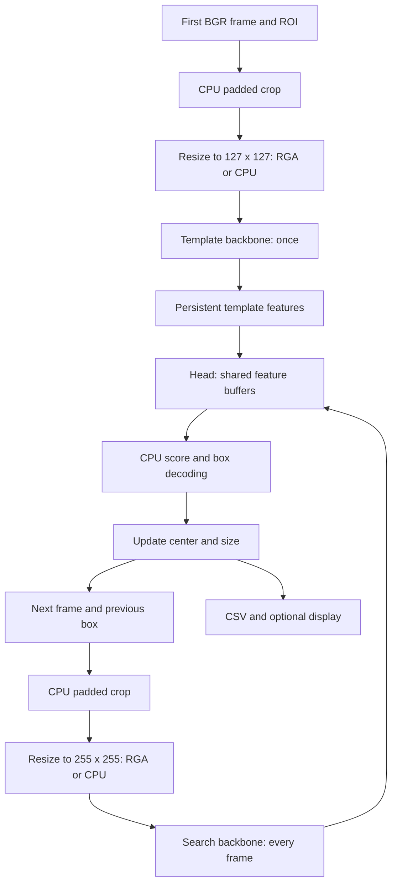

# NanoTrackV3 with RKNN and RGA

[nanotrack_rknn_rga.cpp](nanotrack_rknn_rga.cpp) is a standalone C++17,
single-object video tracker intended for an RK3566 board such as the Radxa
Zero 3W. You select a rectangle in the first frame; the program follows that
object in subsequent frames. It does not detect objects, assign class labels,
track multiple objects, or automatically reacquire a lost target.

OpenCV reads video, constructs crops, draws results, and optionally resizes.
RKNN runs three neural networks on the Rockchip runtime. RGA is used for resize
when available. This executable is not a GStreamer plugin.

This document describes the current source, including its limitations. The
source review was static. The executable has since been cross-compiled on the
x86-64 host using the board sysroot and its `--help` tested on the board.
Inference accuracy, DMA/cache behavior, and performance remain unvalidated.
See [Cross-compiling](CROSS_COMPILING.md) for the verified build flow and sysroot
synchronization details.

## Build on the board

You need a C++17 compiler, pkg-config, OpenCV development files (core, imgproc,
videoio, and highgui), librga headers/library, and `rknn_api.h` plus
`librknnrt.so`. The board also needs working RGA/NPU drivers and permission to
access their devices. Use headers and libraries compatible with the installed
board stack and models.

The local [CMakeLists.txt](CMakeLists.txt) builds this executable. For a native
board build, run from the repository root:

```bash
cmake -S radxa/nano -B build/nano -DCMAKE_BUILD_TYPE=Release
cmake --build build/nano
```

For a host-to-board build, use the [cross-compiling guide](CROSS_COMPILING.md).
Alternatively, build directly on the board:

```bash
pkg-config --modversion opencv4 librga
mkdir -p build/nano
g++ -std=c++17 -O2 -Wall -Wextra \
  radxa/nano/nanotrack_rknn_rga.cpp \
  -o build/nano/nanotrack_rknn_rga \
  $(pkg-config --cflags --libs opencv4 librga) \
  -lrknnrt
```

This assumes RKNN is installed in the compiler/linker's standard search paths.
For an SDK outside those paths, use its actual include and library directories:

```bash
export RKNN_INCLUDE_DIR=/absolute/path/to/rknn/include
export RKNN_LIB_DIR=/absolute/path/to/rknn/lib

g++ -std=c++17 -O2 -Wall -Wextra \
  radxa/nano/nanotrack_rknn_rga.cpp \
  -o build/nano/nanotrack_rknn_rga \
  -I"$RKNN_INCLUDE_DIR" -L"$RKNN_LIB_DIR" \
  -Wl,-rpath,"$RKNN_LIB_DIR" \
  $(pkg-config --cflags --libs opencv4 librga) \
  -lrknnrt
```

The include search path must resolve `<rga/im2d.h>` and `<rga/rga.h>` as written
in the source. If `librga.pc` is outside the usual pkg-config directories, add
its directory to `PKG_CONFIG_PATH`. Even `--resize cpu` requires librga at build
and load time; it only bypasses RGA calls during preprocessing.

## Prepare the models

All models must be compiled for the target board and have the expected
NanoTrackV3 inputs and outputs. ONNX files cannot be passed to this executable.
See the [ONNX-to-RKNN conversion guide](../../docs/usage/nanotrack-onnx-to-rknn.md)
for conversion and calibration details, and the
[Python ONNX tracker](../../demos/nanotracker/onnx/onnx_demo.py) for a reference.

`--models` selects a directory containing the three files. `--precision` only
selects filenames; it does not convert, quantize, or inspect model precision.

| Mode | Template file | Search file | Head file |
| --- | --- | --- | --- |
| `fp16` | `nanotrack_backbone_template.rknn` | `nanotrack_backbone.rknn` | `nanotrack_head.rknn` |
| `mixed` (default) | `nanotrack_backbone_template.rknn` | `nanotrack_backbone.rknn` | `nanotrack_head_int8.rknn` |
| `int8` | `nanotrack_backbone_template_int8.rknn` | `nanotrack_backbone_int8.rknn` | `nanotrack_head_int8.rknn` |
| `int8-mmse` | `nanotrack_backbone_template_int8_mmse.rknn` | `nanotrack_backbone_int8_mmse.rknn` | `nanotrack_head_int8_mmse.rknn` |

In particular, `mixed` means unsuffixed backbones and an INT8 head. The MMSE
mode requires separately prepared artifacts; the flag performs no calibration.
The conversion guide exports unsuffixed filenames into separate precision
folders. Its FP16 folder can be used directly with `--precision fp16`; its INT8
outputs need the suffixes above before using this program's INT8 mode.

### Included model files

The nine files in [models/](models/) were copied from
`radxa:/home/radxa/projects/rknn_demo2/rknn/models/` and verified against the
board with SHA-256. Use `--models radxa/nano/models` from the repository root.
Only three files are loaded per run, as selected by the mode table above.

The descriptions below follow the filenames and the C++ model contract.
The copied artifacts' compiler settings and calibration history have not been
independently verified; a precision suffix is not proof of every operator's
internal arithmetic type.

| Model file | Description | Used by |
| --- | --- | --- |
| [nanotrack_backbone_template.rknn](models/nanotrack_backbone_template.rknn) | FP16-mode template backbone. Encodes the initial 127 × 127 BGR target crop into 96 × 8 × 8 features. Runs once; its cached output is the target reference for every later frame. | `fp16`, `mixed` |
| [nanotrack_backbone.rknn](models/nanotrack_backbone.rknn) | FP16-mode search backbone. Encodes a 255 × 255 BGR crop around the previous target position into 96 × 16 × 16 features. Runs on every tracked frame. | `fp16`, `mixed` |
| [nanotrack_head.rknn](models/nanotrack_head.rknn) | FP16-mode tracking head. Compares the cached template features with current search features, producing two classification planes and four box-distance planes on a 15 × 15 grid. Runs on every tracked frame. | `fp16` |
| [nanotrack_backbone_template_int8.rknn](models/nanotrack_backbone_template_int8.rknn) | INT8-named version of the template backbone, with the same crop and feature contract. Any difference in template features persists throughout the sequence because the template is not recomputed. | `int8` |
| [nanotrack_backbone_int8.rknn](models/nanotrack_backbone_int8.rknn) | INT8-named version of the search backbone, with the same 255 × 255 crop and 96 × 16 × 16 feature contract. Produces the current-frame features for the head. | `int8` |
| [nanotrack_head_int8.rknn](models/nanotrack_head_int8.rknn) | INT8-named tracking head with the same feature inputs and classification/distance outputs. This is the only INT8-named file selected in `mixed` mode. | `mixed`, `int8` |
| [nanotrack_backbone_template_int8_mmse.rknn](models/nanotrack_backbone_template_int8_mmse.rknn) | MMSE-labeled INT8 template variant. Fills the same once-per-run template role and uses the same shapes; selecting it does not recalibrate the model. | `int8-mmse` |
| [nanotrack_backbone_int8_mmse.rknn](models/nanotrack_backbone_int8_mmse.rknn) | MMSE-labeled INT8 search variant. Fills the same per-frame search role and uses the same shapes. Compare its tracking results with the ordinary INT8 search model on the same video and ROI. | `int8-mmse` |
| [nanotrack_head_int8_mmse.rknn](models/nanotrack_head_int8_mmse.rknn) | MMSE-labeled INT8 head variant. Consumes template/search features and returns the same 15 × 15 classification and distance maps; CPU postprocessing still selects and smooths the final box. | `int8-mmse` |

All variants use the C++ buffer types and layouts described below: UINT8 BGR
images, FLOAT32 NHWC features, and FLOAT32 NCHW head outputs. The head does not
return a final video-space rectangle; the application decodes its distances,
ranks candidates, and updates the tracked box. No mode changes the crop sizes
or enables automatic target detection.

## Run

Run these examples from the repository root. Paths are relative to the current
working directory, not the executable or source directory.

Interactive selection using FP16 artifacts from the conversion guide:

```bash
./build/nano/nanotrack_rknn_rga \
  --video assets/camera_run_2s_10s.mp4 \
  --models demos/nanotracker/rknn/fp16 \
  --precision fp16 \
  --resize cpu
```

Draw a rectangle around the target in the first frame and confirm the OpenCV
ROI selection with Enter or Space. Cancelling/returning an empty ROI exits
without tracking. During tracking, press `q` or Escape to stop.

For a headless run, provide an explicit ROI. Replace the example rectangle with
one enclosing the target in your video's first frame:

```bash
./build/nano/nanotrack_rknn_rga \
  --video assets/camera_run_2s_10s.mp4 \
  --models demos/nanotracker/rknn/fp16 \
  --precision fp16 \
  --roi 100,80,60,90 \
  --resize cpu \
  --no-display \
  --boxes build/nano/boxes_cpu.csv
```

Repeat with `--resize auto --boxes build/nano/boxes_auto.csv` to exercise RGA
and compare the resulting trajectories. Successful execution alone does not
establish that both resize paths produce equivalent tracking.

| Option | Default | Meaning |
| --- | --- | --- |
| `--video PATH` | `assets/camera_run_2s_10s.mp4` | Passed as a string to `cv::VideoCapture`. `--video 0` is not implemented as an integer camera index. |
| `--models DIR` | `rknn/models` | Directory of compiled models; supply your actual location. |
| `--precision MODE` | `mixed` | One of the four filename selections above. |
| `--roi x,y,w,h` | Interactive | First-frame rectangle in original image pixels. Use finite coordinates and positive dimensions inside the frame. |
| `--resize MODE` | `auto` | `auto` tries RGA; `cpu` uses OpenCV resize. RKNN inference is used in both modes. |
| `--no-display` | Display enabled | Disables the tracking window, but does **not** disable interactive ROI selection. Pair with `--roi`. |
| `--boxes FILE` | Disabled | Writes headerless `x,y,width,height` rows; an existing file is truncated. Parent directories must exist. |
| `--help` | — | Prints usage and exits before loading models. |

Unknown flags, missing option values, and most runtime errors report `Error:`
and exit with status 1. Models load before the video opens or ROI is selected.

## Data flow and tensor contract



The logical graph shapes below match the repository's documented ONNX models.
The C++ wrapper requests different boundary layouts where indicated; the RKNN
runtime must support those requests for the compiled artifacts.

| Boundary | Logical graph shape (NCHW) | Requested C++ buffer |
| --- | --- | --- |
| Template image | `[1,3,127,127]` | UINT8 NHWC, interleaved BGR |
| Search image | `[1,3,255,255]` | UINT8 NHWC, interleaved BGR |
| Template features / head input 0 | `[1,96,8,8]` | FLOAT32 NHWC; 6,144 floats |
| Search features / head input 1 | `[1,96,16,16]` | FLOAT32 NHWC; 24,576 floats |
| Head output 0: classification | `[1,2,15,15]` | FLOAT32 NCHW; 450 floats |
| Head output 1: box distances | `[1,4,15,15]` | FLOAT32 NCHW; 900 floats |

Pixels remain BGR in the 0–255 range: there is no RGB conversion, division by
255, or explicit mean subtraction in the C++ preprocessing. Model conversion
must preserve the matching preprocessing contract. INT8 model selection still
uses UINT8 image buffers and FLOAT32 feature/head-output buffers in this code.

## Code walkthrough

### Model ownership and shared memory

`read_file()` reads the compiled model into a byte vector. `Model` calls
`rknn_init()`, queries input/output counts and attributes, and owns an RKNN
context plus its allocated/imported tensor-memory objects. `check()` turns
negative RKNN return codes into exceptions.

`allocate_image_input()` requests UINT8 NHWC with `pass_through = 0` and binds
persistent memory using `rknn_set_io_mem()`. It manually rounds both dimensions
up to multiples of 16:

| Image | Logical bytes | Allocated dimensions | Allocated bytes / row step |
| --- | --- | --- | --- |
| Template, 127 × 127 | 48,387 | 128 × 128 | 49,152 / 384 |
| Search, 255 × 255 | 195,075 | 256 × 256 | 196,608 / 768 |

The padded allocation is not a change to the model's logical image size.
`allocate_float_output()` allocates `n_elems * sizeof(float)` and requests the
chosen layout. Backbone outputs are requested as NHWC; head outputs as NCHW.

`import_float_input()` imports each backbone output's DMA-BUF file descriptor
into the head context, reusing its virtual address and offset. This avoids an
explicit application copy of feature arrays. It does not establish that the
runtime performs no internal layout or type conversions. Rockchip documents
the memory binding/import interfaces in its
[RKNN API header](https://github.com/airockchip/rknn-toolkit2/blob/master/rknpu2/runtime/Linux/librknn_api/include/rknn_api.h).

The models are constructed as template, search, then head. Normal destruction
reverses that order, so head imports are released before their backbone-owned
storage. `RgaImportedBuffer` separately owns an RGA import handle, releases it
on scope exit, forbids copying, and supports transferring ownership by moving.
It does not own the underlying OpenCV or RKNN allocation.

### Crop, padding, resize, and synchronization

`rga_crop_resize()` is used for both template initialization and each search
frame. It checks the image type (`CV_8UC3`), positive crop/output sizes, and the
destination pointer and capacity.

1. Compute the crop origin as `floor(center - original_size / 2)` on each axis.
2. Allocate a square-height BGR buffer filled with the first frame's mean
   color. Round its physical width up to a multiple of four pixels.
3. Intersect the requested square with the frame and copy that intersection
   into the appropriate position in the padded buffer. Out-of-frame pixels
   retain the mean color. A wholly outside crop raises an error.
4. In `auto` mode, import the CPU crop with `importbuffer_virtualaddr()` and
   RKNN destination with `importbuffer_fd()`. Wrap both with explicit logical
   sizes and physical strides, then call `imresize()`.
5. If either import or resize reports failure, set the global `use_rga` flag
   false and use CPU resize for this crop and all later crops.

The RGA path synchronizes the destination toward the device before resize and
returns on successful resize without a subsequent CPU-to-device sync. The
intent is to avoid flushing stale CPU data over RGA's writes. The CPU path
synchronizes from the device, clears the destination, wraps the logical image
as a `cv::Mat` with the aligned row step, performs `INTER_LINEAR` resize, then
synchronizes to the device. These are the source's synchronization choices;
actual coherency across the runtime and drivers needs board verification.

Only resize is offloaded: crop allocation, mean-color padding, and frame-region
copying still happen on the CPU. RGA imports are recreated for each crop. A
failed RKNN synchronization throws instead of triggering CPU fallback. Fatal
signals also exit rather than retrying.

### Template initialization and search region

The initial rectangle produces:

```text
center = (x + (width - 1)/2, y + (height - 1)/2)
pad = 0.5 * (width + height)
s_z = sqrt((width + pad) * (height + pad))
```

The first frame's mean BGR color is retained for padding throughout the run.
The template crop has side length `lround(s_z)`, is resized to 127 × 127, and
runs through the template backbone once. Template features never update.

For each later frame, the previous target size determines a fresh `s_z`:

```text
scale = 127 / s_z
search_crop_side = lround(s_z * 255 / 127)
```

The search crop is centered on the previous target center and resized to
255 × 255. The program runs the search backbone and then the head sequentially.
It synchronizes both head outputs from device memory before reading them on
the CPU.

### Score decoding and box update

The fixed response grid has 15 × 15 = 225 locations. Grid coordinates are
`(column - 7) * 16` and `(row - 7) * 16`, spanning −112 to +112 in model-space
coordinates. A separable Hann window is precomputed as the product of the
horizontal and vertical windows.

At location `i`, classification planes contain background and foreground
logits. The code computes `score = exp(foreground)/(exp(background) +
exp(foreground))`. The four localization planes contain left, top, right, and
bottom distances:

```text
x1 = grid_x - left       y1 = grid_y - top
x2 = grid_x + right      y2 = grid_y + bottom
w = x2 - x1             h = y2 - y1
```

`padded_size(w,h)` computes `sqrt((w+p)*(h+p))`, with `p=(w+h)/2`.
The candidate's padded-size ratio to the scaled previous box is `sr`; its
aspect-ratio comparison is `rr = (previous_w/previous_h)/(w/h)`.

```text
penalty = exp(-(max(sr,1/sr) * max(rr,1/rr) - 1) * 0.138)
rank = penalty * score * (1 - 0.455) + hann_window[i] * 0.455
```

The greatest rank wins. The penalty discourages abrupt scale/aspect changes;
the Hann window favors positions near the previous center. Candidate center
offset and dimensions are divided by `scale` to return to video pixels.

```text
learning_rate = best_penalty * best_score * 0.348
new_center = previous_center + candidate_offset
new_size = previous_size * (1-learning_rate) + candidate_size * learning_rate
```

Centers are clamped to `[0, frame_dimension]` and dimensions to
`[10, frame_dimension]`. This assumes frames are at least 10 pixels on each
axis. The resulting rectangle itself is not clipped, so exported x/y can be
negative or its right/bottom edge can extend past the image.

The context factor `0.5`, penalty coefficient `0.138`, window weight `0.455`,
and update coefficient `0.348` are source constants, not CLI options. The crop
sizes, response size, and stride are tied to the model architecture.

### Output, timing, and errors

CSV contains one `x,y,width,height` row per tracked frame, without header,
frame index, timestamp, or confidence. The first video frame initializes the
template and has no CSV row. Thus a fully decoded N-frame video normally
produces N−1 rows. CSV coordinates are floating point; drawing rounds them.
No annotated video is saved.

`Processed frames`, `Average tracking`, and `Tracking FPS` measure the loop
from after frame capture through CSV insertion. They exclude model loading,
initial ROI/template setup, video reading/decoding, drawing, and `waitKey()`.
RGA diagnostic printing and preprocessing are inside the measured interval.
The displayed FPS is cumulative tracking throughput, not end-to-end playback
FPS, and the program does not pace playback to the input video's frame rate.

Normal scope exit releases resources. The outer exception handlers print an
error and call `std::_Exit(1)` after unwinding into the handler. Fatal signal
handlers for SIGSEGV, SIGBUS, SIGABRT, SIGILL, and SIGFPE instead write a fixed
message and immediately exit with `128 + signal`; they do not unwind or flush
buffered CSV. Their suggestion to try CPU resize is not a diagnosis of the
underlying fault.

## Review findings and current limitations

These findings describe the reviewed source; no C++ fixes are included here.
The original missing CMake target has been fixed and cross-build validation is
documented in [Cross-compiling](CROSS_COMPILING.md).

| Priority | Location in C++ | Finding and suggested correction |
| --- | --- | --- |
| High | `Model` allocation/import methods; `main()` output decoding (lines 1054–1083, 1340–1370) | Tensor counts/shapes/order are queried but not validated against the fixed tracker contract. The loop unconditionally reads 450 classification and 900 localization floats. A different head with smaller outputs can cause out-of-bounds reads; changed output order/layout can silently produce wrong boxes. Validate all graph boundaries before binding and decoding. |
| Medium | `parse_args()` ROI branch (lines 906–917) | `sscanf` accepts non-finite coordinates/dimensions and trailing text; positive-size comparisons do not reject NaN. Those values reach crop rounding and float-to-int conversion. Require exactly four finite values, supported size bounds, and a valid initial ROI. |
| Medium | `main()` score calculation (lines 1344–1354) | Direct exponentiation can overflow for large finite logits or underflow both terms to zero, producing NaN scores and invalid candidate selection. Subtract the larger logit before exponentiation, as the Python reference does, and reject non-finite model outputs. |
| Medium | `main()` ROI selection (lines 1104–1112) | `--no-display` without `--roi` still invokes `selectROI`, so unattended runs can block or fail on a GUI-less board. Require an ROI when display is disabled. |
| Medium | CSV loop and exit (lines 1484–1496, 1594) | Only opening the output stream is checked. A later disk-full/write failure can stop CSV output while the program still reports success. Check writes and final flush/close failures. |


A separate hardware-dependent concern is that the wrapper overrides queried
image strides and forces packed FLOAT32 output sizes/layouts. This is not a
general adapter for arbitrary RKNN exports. Verify the bound tensor contract,
output sizes, and shared-buffer coherency against the actual SDK/models before
trusting results. This review does not establish a specific runtime failure
from those choices.

There is no confidence threshold or lost-target state. Even a poor match updates
the tracker, and fixed template features cannot adapt to major appearance
changes. A failed later `capture.read()` ends the loop without distinguishing
normal end-of-file from a decoding failure.

## Troubleshooting and validation on the board

| Symptom | Check |
| --- | --- |
| `Cannot open model` | Working directory, `--models`, and exact filename suffixes. The default mode needs an INT8 head. |
| `rknn_init` or binding failure | Correct target chip, compatible model/runtime/driver, expected tensor contract, and installed libraries. |
| `Cannot open video` | File path and OpenCV video backend/codec availability. |
| GUI error with `--no-display` | Add `--roi x,y,w,h`. |
| RGA import/resize warning | The process switches permanently to CPU resize; compare with an explicit `--resize cpu` run. |
| Fatal process signal | The process exits; rerun with CPU resize to help isolate RGA involvement. A repeated fault needs diagnosis. |
| Wrong boxes or drift | Initial ROI, BGR/preprocessing agreement, graph input/output order/layout, precision artifacts, and the review findings above. |
| Missing CSV | Parent directory and write permissions; later write failures are currently unchecked. |

For a repeatable smoke test, use a short video and the same known ROI in the
headless example for both resize modes. Check that each CSV row has four finite
values and positive dimensions, that row counts match decoded frames minus one,
and visually inspect box overlap with the selected object. Compare against the
Python ONNX tracker as well; exact floating-point or interpolation equality is
not assumed. Record the model files and SDK/driver versions alongside results.
